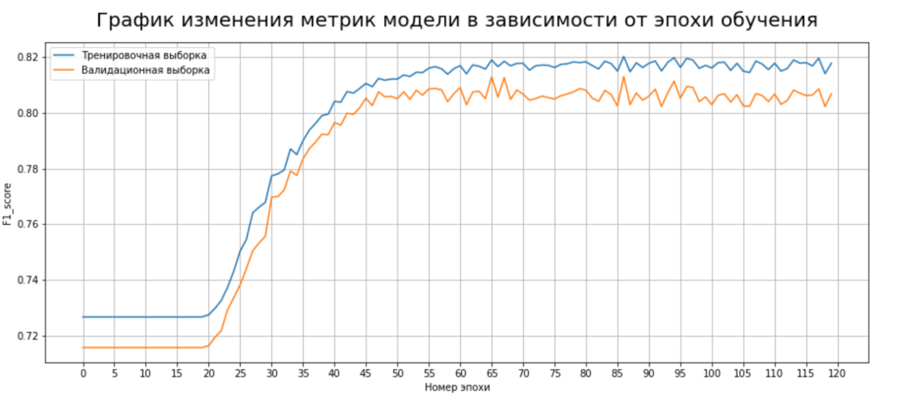
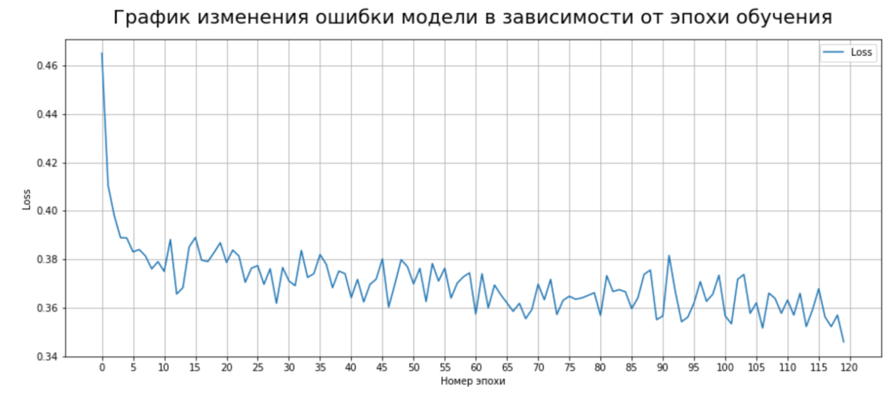
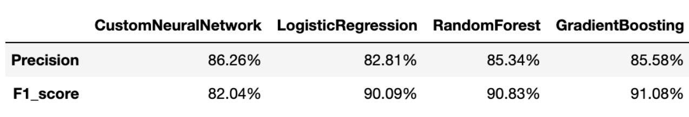

Конечно! Вот пример описания для Readme файла для репозитория с курсовой работой:

# Курсовая работа: Нейронная сеть для определения вероятности платёжеспособности заёмщиков

Этот репозиторий содержит код и отчёт моей курсовой работы на тему "Разработка нейронной сети для определения вероятности платёжеспособности заёмщиков". В данной работе я исследовал применение искусственных нейронных сетей для классификации держателей кредитных карт по вероятности дефолта.

## Содержание репозитория

- [КР Маркович В.С. ТАДиМО.pdf](КР%20Маркович%20В.С.%20ТАДиМО.pdf) - документ, содержащий название вашего файла.
- [Data Analysis.ipynb](Data%20Analysis.ipynb) - файл с кодом по предобработке данных.
- [Models.ipynb](Models.ipynb) - файл с кодом по построению модели, оценкой метрик эффективности модели, а также сравнением нейронной сети с дргуими моделями классического машинного обучения.
- [data.csv](data.csv) - исходный датасет с kaggle.
- [Data_Train.csv](Data_Train.csv) - обраблотанный датасет.
- [README.md](README.md) - данный файл, содержащий общую информацию о репозитории и описание его содержимого.

## Метрика эффективности F1

Описание метрики F1 и ее значение для вашей модели.

## График падения функции ошибки

Описание графика, показывающего падение функции ошибки в процессе обучения.

## Сравнение с другими моделями

Описание сравнения вашей модели с другими моделями.

## Зависимости и установка

Для запуска кода и воспроизведения результатов курсовой работы необходимо установить следующие зависимости:

- Python 3.9.12
- PyTorch 1.13.1
- pandas 2.0.2
- numpy 1.24.3
- sklearn 1.0.2
- matplotlib 3.5.1
- seaborn 0.11.2

## Автор

Маркович Владимир
